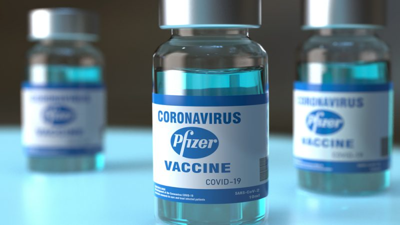

```{r setup, include=FALSE}
knitr::opts_chunk$set(echo = FALSE)
```

## Article 5 : Pfizer’s vaccine appears to reduce coronavirus transmission





## I – Source of the article with publication date and word count:


Source of the article:  <https://www.sciencenews.org/article/coronavirus-covid-19-pfizer-vaccine-may-reduce-transmission> (12/02/2021)


Word count: 859


## II – Vocabulary: 


| Word from the text | Synonym/definition in English | French translation | 
|:----------:|:-------------:|:------:|
| **Aerosols** | Pressurized gas | aérosol |
| **Boost** | Promote, support | stimuler |
| **Computational** | Involving calculation | informatique, statistique |
| **Curb** | Limit, restrict | maitriser, modérer |
| **Droplets** | Small drop of fluid | gouttelette |
| **Genealogy** | Study of ancestry | généalogie |
| **Grasp** | Understanding | compréhension |
| **Harbor** | Shelter secretly | donner asile à |
| **Preliminary** | Preparatory | préliminaire |
| **Rollout** | Introduce something new to public | lancer |
| **Snapshot** | Depicts momentary condition | aperçu |
| **Swath** | Figurative (strip, trail) | bande, zone |
| **Swiftly** | Quickly | rapidement |
| **Transmission** | Something transmitted | transmission |
| **Viral Loads** | Amount of a virus in body fluid | charge viral |


## III – Analysis table about the study:


**Researchers?** 


      * Marm Kilpatrick (infectious diseases researcher) University of California (Santa Cruz)
     * Ella Petter, (computational biologist) Or Yehuda (Israel)


**Published in? when (if mentioned)?**  


medRxiv.org (February 8 2021).


**General topic**  


Vaccinated people tend to carry less virus in their bodies than unvaccinated people and can curb the coronavirus’s spread, not just prevent people from getting seriously ill. 


**Procedure/what was examined** 


* People vaccinated with Pfizer’s shots and who still get infected with the coronavirus carry less virus in their bodies
1. Clinical trial:
    * Pfizer’s vaccine had 95 percent efficacy to prevent COVID-19 symptoms
    * Comparison of the levels of virus in more than 15,000 coronavirus test samples
    * Samples that tested positive for the coronavirus from people over age 60 had lower levels of the coronavirus
    * Use of computational analyses 

2. In a separate study:
    * People who got infected within the 12 days following their first Pfizer shot and had little to no protection against COVID-19 have more coronavirus in the body 

3. Past studies:
    * When there is less virus in the body, a person is less likely to pass on coronavirus to others compared with people with a higher viral load. 
    * Vaccinated people who still get infected have less virus than unvaccinated people


**Conclusions/discovery**   

 
Pfizer’s vaccine might reduce the spread of coronavirus.
 
 
**Remaining questions**   ///
